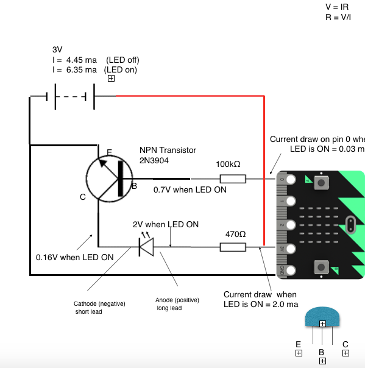

# Test

## Image  (png)



## YouTube Video

  <iframe width="560" height="315" src="https://www.youtube.com/embed/VdGRsR1m2Oo" frameborder="0" allowfullscreen></iframe>

## Code Block

```python
s = "Python syntax highlighting"
print s
```

## Table

| Column 1 | Column 2| Column 3 |
| ---:|:---:| ---:|
| 1 | 2 | 3 |
| 4 | 5| 6| 

### Horizontal Rule

___

***

___

## Links

[python code for Raspbery Pi Train Controller](https://github.com/phwallen/smrc)

